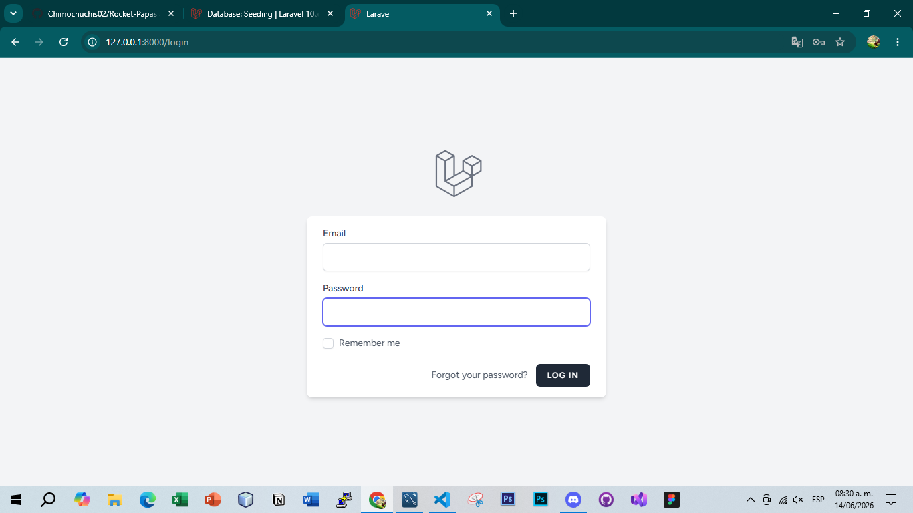

## About Laravel

Laravel is a web application framework with expressive, elegant syntax. We believe development must be an enjoyable and creative experience to be truly fulfilling. Laravel takes the pain out of development by easing common tasks used in many web projects, such as:

- [Simple, fast routing engine](https://laravel.com/docs/routing).
- [Powerful dependency injection container](https://laravel.com/docs/container).
- Multiple back-ends for [session](https://laravel.com/docs/session) and [cache](https://laravel.com/docs/cache) storage.
- Expressive, intuitive [database ORM](https://laravel.com/docs/eloquent).
- Database agnostic [schema migrations](https://laravel.com/docs/migrations).
- [Robust background job processing](https://laravel.com/docs/queues).
- [Real-time event broadcasting](https://laravel.com/docs/broadcasting).

Laravel is accessible, powerful, and provides tools required for large, robust applications.

## Learning Laravel

Laravel has the most extensive and thorough [documentation](https://laravel.com/docs) and video tutorial library of all modern web application frameworks, making it a breeze to get started with the framework.

You may also try the [Laravel Bootcamp](https://bootcamp.laravel.com), where you will be guided through building a modern Laravel application from scratch.

If you don't feel like reading, [Laracasts](https://laracasts.com) can help. Laracasts contains over 2000 video tutorials on a range of topics including Laravel, modern PHP, unit testing, and JavaScript. Boost your skills by digging into our comprehensive video library.

## Laravel Sponsors

We would like to extend our thanks to the following sponsors for funding Laravel development. If you are interested in becoming a sponsor, please visit the Laravel [Patreon page](https://patreon.com/taylorotwell).

### Premium Partners

- **[Vehikl](https://vehikl.com/)**
- **[Tighten Co.](https://tighten.co)**
- **[Kirschbaum Development Group](https://kirschbaumdevelopment.com)**
- **[64 Robots](https://64robots.com)**
- **[Cubet Techno Labs](https://cubettech.com)**
- **[Cyber-Duck](https://cyber-duck.co.uk)**
- **[Many](https://www.many.co.uk)**
- **[Webdock, Fast VPS Hosting](https://www.webdock.io/en)**
- **[DevSquad](https://devsquad.com)**
- **[Curotec](https://www.curotec.com/services/technologies/laravel/)**
- **[OP.GG](https://op.gg)**
- **[WebReinvent](https://webreinvent.com/?utm_source=laravel&utm_medium=github&utm_campaign=patreon-sponsors)**
- **[Lendio](https://lendio.com)**

## Contributing

Thank you for considering contributing to the Laravel framework! The contribution guide can be found in the [Laravel documentation](https://laravel.com/docs/contributions).

## Code of Conduct

In order to ensure that the Laravel community is welcoming to all, please review and abide by the [Code of Conduct](https://laravel.com/docs/contributions#code-of-conduct).

## Security Vulnerabilities

If you discover a security vulnerability within Laravel, please send an e-mail to Taylor Otwell via [taylor@laravel.com](mailto:taylor@laravel.com). All security vulnerabilities will be promptly addressed.

## License

The Laravel framework is open-sourced software licensed under the [MIT license](https://opensource.org/licenses/MIT).

De esta parte en adelante, es la documentacion del back y parte del front para dicha pagina web...comenzando por agradecer a todos los de mi alrededor y personas que han estado conmigo, desde mi familia quienes tal vez no entiendan todo esto que me gusta o el porque me gusta...pero aun asi me apoyan por mi trabajo que he hecho hasta el momento y de lo que sere capaz de hacer en un futuro, hasta mis tutores, industrial y escolar, por confiar en que podria hacer esto, como mas y darme la seguridad para aventarme a hacer algo mas complejo que solo una landing page, sino un sistema ya funcional y en produccion en la nube, algo muy importante para el portafolio de un desarrollador fullstack, hasta mis compañeros y amigos, los cuales siempre han creido en mi aun cuando yo no lo hacia, pero que me da la fuerza de seguir a pesar de todo y...de seguir mis sueños a pesar de que la vida es compleja, complicada y a veces muy injusta, pero siempre hay margen para volver a intentarlo, las veces que sea necesario...siempre he pensado en que rendirse y ceder es la unica forma de fallar...fallar es solo una forma de mejorar y sobre todo...levantarse, aprender y ajustar, no hay formula secreta para el exito mas que, la resiliencia, la cual duele, duele mucho siempre por lo que a veces significa el avanzar sin ver atras...pero la cual es la que nos hace ir mas lejos que nunca, este sistema no solo representa una mejoria para el negocio, sino tambien una oportunidad de crecimiento para el desarrollador, en este caso: Yo(Angel Dominguez o tambien Chimochuchis02 mi id en el mundo virtual).

Pero bueno, comencemos con dicha documentacion, empezando por algo...basico pero necesario, este sistema esta creado para un negocio llamado Rocket Papas, un negocio de comida relativamente nuevo, pero que tiene mucho potencial, este sistema primero comenzo como una sola landing page para que la gente viera el menu, precios, imagenes en 3D con los visores tanto de la comida como del lugar del paso de la rosita, pero al final me propusieron agregarle 2 cosas mas complejas en produccion o tambien llamado en la nube: Dashboard de administrador y CRUD de las imagenes de los productos y promociones...

<h1> Login y Seeders </h1>
Primero quisiera explicar que es un seeder, que es lo primero que hice un domingo a las 7 de la mañana, no podia dormir al estar tan emocionado en que iba a hacer un sistema mas complejo con bases de datos en produccion, asi que prendi mi laptop y me puse a trabajar en ello: Segun la documentacion oficial de laraverl 10.5 que es el que utilice, los "seeders" es insertar datos especificos, controlados, reales y fijos/estaticos en el sistema de manera segura...la razon por la que utilice seeders es que tenia la duda de como poner un login y registros de un administrador sin que los usuarios no administrativos vieran dicha parte y pudieran hacer cosas en el sistema como borrar o agregar cosas indebidas o que no tienen sentido, como imagenes o etc.

Recorde algo que me dijo un profe que me dio Base de datos y POO, algo importante para la ciberseguridad: Solo existe 1 admin y se hace con "Seeders"...sinceramente ahorita no sabia como hacerlo en laravel asi que tuve que leer la documentacion e implemente dicho usuario administrador sin necesidad de un formulario de registros e hice 2 cosas mas...quitar los botones de login y register para el usuario normal, ya que eso los confudiria mucho porque pensarian que se tienen ellos que registrar, cuando en realidad ellos no...asi que el admin utiliza rutas o routes para moverse a la seccion de login, siendo el nombre de la pagina + <strong> /login </strong> para entrar al formulario de login:  

Teniendo en este caso dicho formulario y donde despues se implementaria el logo de rocket papas y sus colores enves de los de laravel:
<!--Imagen con el logo de Rocke-->
y claro los seeders son bastante complejos, pero leyendo la documentacion pude ver que simplemente como lo dice la documentacion es solo para la ciberseguridad y para evitar que los no administradores puedan romper un sistema complejo o evitar este tipo de conflictos: 
.png)
Aqui esta una foto de lo que tuve que hacer con la documentacion al lado para poder crear un usuario como administrador directamente en seeder y sin usar formularios de registro para no usar ese apartado y que los usuarios que vean dicha pagina no se confundan.
.png)
Y finalmente en este codigo se encuentra la base madre o la base para poder correr los archivos con sus clases respectivas para hacer seeders, la cual en este caso, lo unico que hace es el usuario administrador es correr su clase para insertar dichos datos directamente en el servidor...ya sea en MySql o ya en un servidor en la nube, de lo cual hare la documentacion de esa parte tambien y la cual se encuentra en la parte de totalmente abajo de todo esto, esto es solo el comienzo.

<h2> Base De datos y su arquitectura desde 0</h2>
.png)

.png)

.png)

.png)

.png)

.png)

